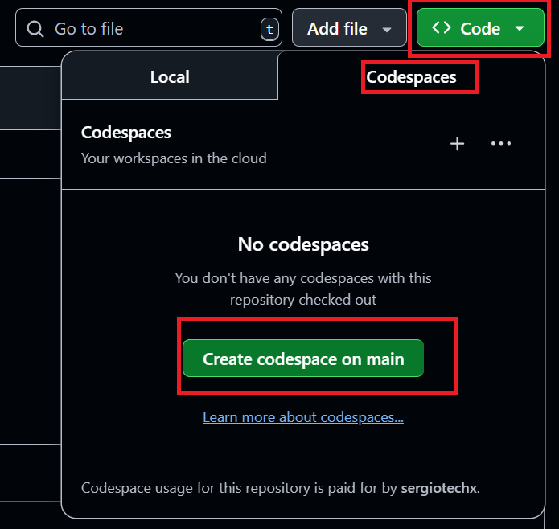
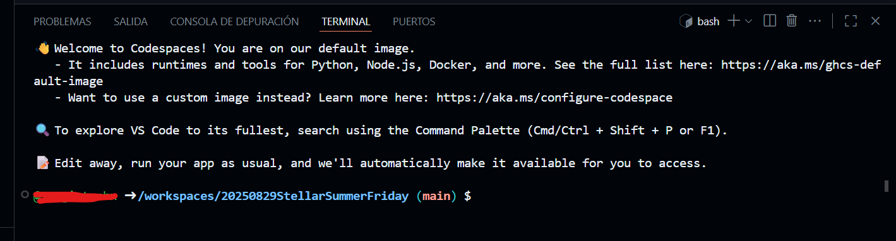

# 🧩 Contratos de Ejemplo – Soroban & Stellar

Este directorio contiene contratos de ejemplo en **Rust** para comprender la lógica básica y las operaciones fundamentales en **Soroban**, el entorno de smart contracts de **Stellar**.

---

## ⚙️ Entorno de desarrollo

Antes de comenzar, asegúrate de contar con un entorno configurado correctamente.  
Puedes usar **GitHub Codespaces**, que te permite trabajar directamente en la nube ☁️ con un entorno similar a **VS Code**, sin instalar nada localmente.

1. Abre el repositorio en GitHub.  
2. Haz clic en **Code → Codespaces → Create codespace on main**.  
3. ¡Listo! Tendrás un entorno listo para compilar, probar y desplegar contratos.

---

  
👉 ¡Y listo! Tienes un **VS Code en el navegador** 🌐⚡ con todas las dependencias y configuraciones necesarias 🎯

Perfecto para programar desde cualquier lugar 🌍 sin instalar nada en tu PC 🖥️.

---

## 🛠️ Preparación del entorno
Una vez que la máquina virtual esté lista (por ejemplo, mediante Codespaces), ejecuta el siguiente comando en la terminal para instalar todas las dependencias necesarias:

`bash ./scripts/install.sh`

Este script automatiza la configuración del entorno: instala herramientas necesarias, dependencias de Rust / Soroban, y prepara el sistema para compilar y desplegar contratos.

---
## 🪙 Creación de una entidad (alias de billetera)

Para desplegar contratos o ejecutar operaciones que modifiquen el estado en la red de pruebas (**testnet**), necesitas:

1. Crear una cuenta o alias — que actuará como tu **identidad**
2. Obtener fondos de prueba para esa cuenta

Puedes lograr esto ejecutando:

 

`stellar keys generate --global <alias> --network testnet --fund stellar keys address <alias>`

* `stellar keys generate … --fund` genera la cuenta con fondos iniciales en testnet.
* `stellar keys address <alias>` muestra la dirección pública asociada al alias, que usarás para interacciones con contratos.
---
## 🧪 Proyectos de ejemplo

Explora cada uno de estos contratos para practicar y aprender:

| Proyecto | Descripción |
|---|---|
| [🌍 Hello World](./hello-world/README.md) | Primer contrato, despliegue e invocación sencilla |
| [🔢 Data Types](./data-types/README.md) | Uso de tipos de datos básicos en Rust / Soroban |
| [🔀 If–Else](./ifelse/README.md) | Lógica condicional en contratos |
| [🧩 Funciones](./functions/README.md) | Definición y uso de funciones públicas/privadas |
| [📚 Biblioteca](./library/README.md) | Código modular y reutilizable |

---

🏠 [Volver al README principal](../README.md)  
